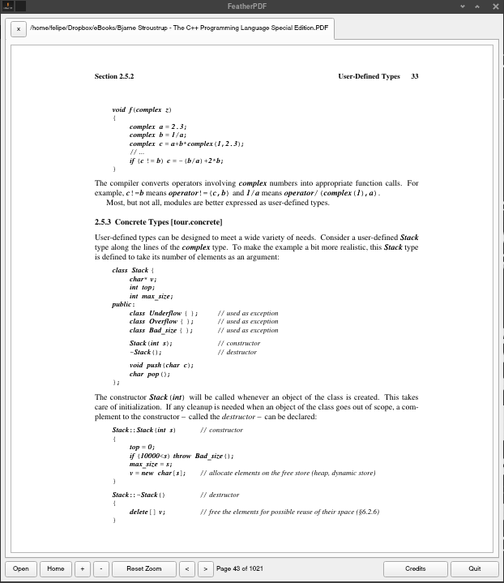

## FeatherPDF - Lightweight PDF Viewer
#### Description

FeatherPDF is an ultra-lightweight PDF viewer designed for Linux and macOS. It provides a simple and intuitive user interface for reading PDF documents. The project aims to offer a fast and minimalistic PDF reading experience while using minimal system resources.


[](https://github.com/Naereen/badges/)


[](https://lbesson.mit-license.org/)
<!--
[](http://perso.crans.org/besson/LICENSE.html)
-->

[](https://www.vim.org/)
[](https://code.visualstudio.com/)


[](https://www.python.org/downloads/release/python-311/)
[](https://pypi.org/project/PyQt5/)

#

#### Prerequisites:

Before you begin, ensure you have met the following requirements:

- **Python 3.11:** FeatherPDF requires Python 3.11 or later. If you don't have Python installed, you can download it from the [official Python website](https://www.python.org/downloads/release/python-311/).

- **PyQt5:** FeatherPDF uses the PyQt5 library for its user interface. You can install PyQt5 using a package manager. For example, on macOS and Linux, you can use Homebrew:


  ```
  brew install python
  ```
  
  ```
  brew install pyqt@5
  ```


#### Screenshots

[](#)



<!-- 

--> 
<!-- 
**Arch Linux** 


**macOS** 


-->


#### Futures

[](#)

- Open and view PDF files with ease.
- Navigate through pages using on-screen controls or mouse scroll.
- Zoom in and out for comfortable reading.
- Return to the first page or navigate to the next/previous pages.
- Responsive and intuitive user interface.
- MIT Licensed - Free and open-source.

#### Version 1.0.0

The current version, 1.0.0, introduces the core functionality of FeatherPDF. Users can open PDF files, navigate through pages, zoom in/out, and enjoy a seamless reading experience.

#### Installation
#### Via AUR using YAY

[](https://aur.archlinux.org/packages/feather-pdf)

<!-- 
[](https://aur.archlinux.org/packages/feather-pdf)
-->

https://aur.archlinux.org/packages/feather-pdf

FeatherPDF is available on AUR (Arch User Repository), and it can be installed using the `yay` package manager. Follow the steps below to install FeatherPDF:

1. Make sure you have `yay` installed. If not, you can install it with the following command:
   
   ```
   sudo pacman -S yay
   ```
   Once yay is installed, you can install by running the following command:
   
   ```
   yay -S feather-pdf
   ```
This command will automatically fetch the package from AUR and handle the installation process for you.


#### 🤝 Support and Contributions

If you find this project helpful and would like to support its development, there are several ways you can contribute:

- **Code Contributions**: If you're a developer, you can contribute by submitting pull requests with bug fixes, new features, or improvements. Feel free to fork the project and create your own branch to work on.
- **Bug Reports and Feedback**: If you encounter any issues or have suggestions for improvement, please open an issue on the project's GitHub repository. Your feedback is valuable in making the project better.
- **Documentation**: Improving the documentation is always appreciated. If you find any gaps or have suggestions to enhance the project's documentation, please let me know.

[](https://www.buymeacoffee.com/felipealfonsog)
[](https://www.paypal.me/felipealfonsog)
[](https://github.com/sponsors/felipealfonsog)

Your support and contributions are greatly appreciated! Thank you for your help in making this project better.


#### 📝Important

[](#)

This is an experimental project aimed at bringing a PDF viewer or reader to the terminal environment. The Terminal PDF Viewer leverages the capabilities of the MuPDF library to enable users to view PDF documents directly within the terminal.

This project is still in its experimental (v.0.0.2 - not yet as a 1.0.0 version) stage and may have limitations in terms of features and compatibility. Use at your own discretion.

#### NOTES

To generate the binary: 

```
pyinstaller --onefile featherpdf.py
```

#### 📄 License

This project is licensed under the [MIT License](LICENSE).
